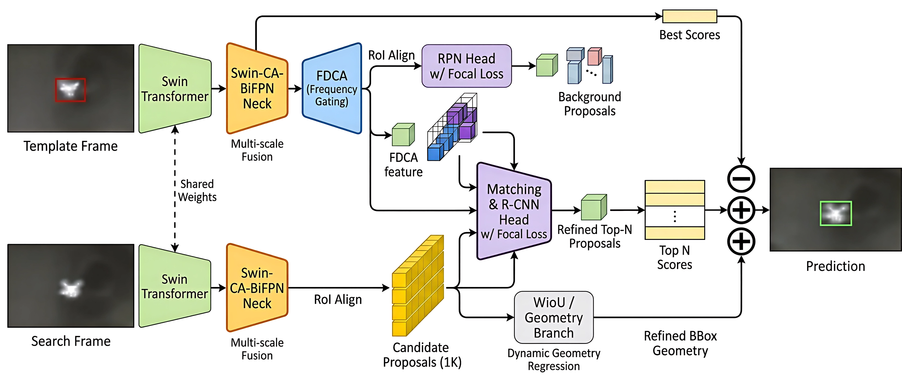
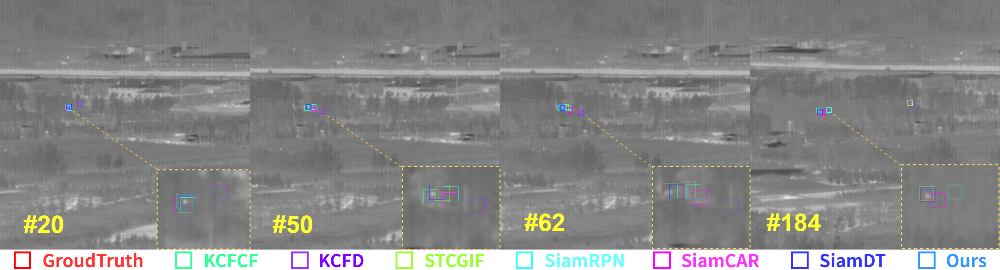
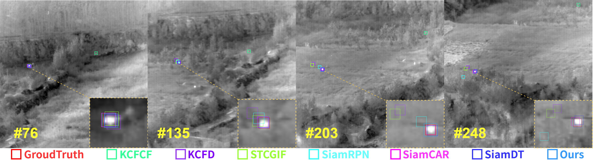
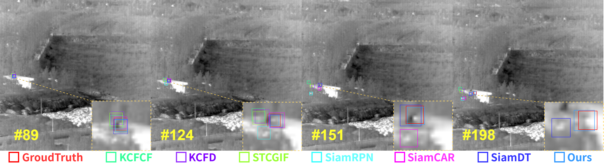
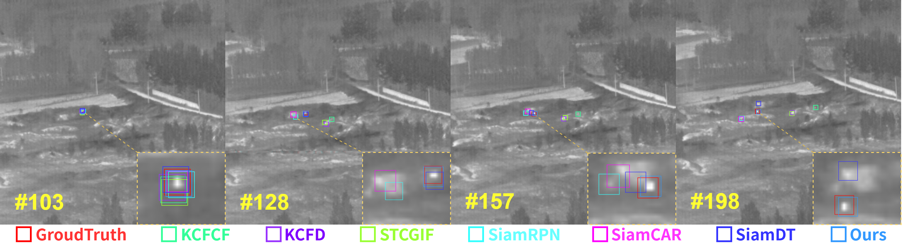
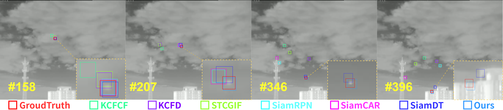

# SiamDT-Infrared-Drone-Tracking-via-Frequency-Domain-Perception
Official implementation of "SiamDT++: Infrared Drone Tracking via Frequency Domain Perception". A robust SOTA tracker for tiny IR targets using FFT spectral gating and Swin-CA-BiFPN.

 

## 摘要 (Abstract)

在红外（IR）领域追踪“低慢小”无人机（UAV）极具挑战性，主要面临**特征稀疏**、**热交叉（Thermal Crossover）**以及**复杂背景干扰**等难题。

为了克服现有孪生网络中的特征弥散和背景抑制不足，我们提出了 **SiamDT++**。该架构集成了多尺度频域感知和动态聚焦机制：
1. **Swin-CA-BiFPN**：双向融合浅层纹理与深层语义，增强对点状目标的感知。
2. **FDCA (频域感知交互模块)**：利用频谱门控抑制低频杂波并增强高频边缘，解决热交叉下的特征退化。
3. **动态聚焦预测头**：重构损失函数（Focal Loss + Wise-IoU），实现像素级回归精度。

## 核心创新 (Technical Highlights)

### 1. Swin-CA-BiFPN：几何感知特征提取
针对极小目标（<5 像素）在深层网络中容易丢失的问题，我们设计了混合架构：
* **双向特征金字塔 (BiFPN)**：通过 Bottom-up 路径将浅层高分辨率纹理传递给深层，保留空间索引。
* **坐标注意力 (Coordinate Attention)**：将注意力分解为两个一维编码过程，强制网络关注目标的精确定位。

### 2. FDCA：频域全局感知交互
当目标与背景温度接近（热交叉）时，空间特征往往失效。FDCA 模块通过傅里叶变换在频域进行处理：
$$X_{u,v}=\sum_{h=0}^{H-1}\sum_{w=0}^{W-1}x_{h,w}e^{-j2\pi(\frac{hu}{H}+\frac{wv}{W})}$$
利用可学习的频谱权重 $W_{gate}$ 滤除背景噪声，显著提升信噪比（SNR）。

### 3. 动态聚焦损失系统
为了解决正负样本极度不平衡问题 ：
* **分类**：引入 **Focal Loss**，使模型聚焦于特征稀疏的硬样本（Hard Samples）。
* **回归**：采用 **Wise-IoU (WIoU)**，根据锚框质量动态分配梯度增益，防止标注噪声误导模型。

---

## 模型架构 (Architecture)

*图 1: SiamDT++ 算法总体框架图*

---

## 实验结果 (Experimental Results)

### 1. 定量分析 (Quantitative Results)
我们在 **Anti-UAV410** 数据集上进行了 One-Pass Evaluation (OPE) 评估：

| 算法 | 骨干网络 | 精确度 (Precision) | 成功率 (Success Rate) |
| :--- | :--- | :--- | :--- |
| SiamDT (Baseline) [cite: 384] | Swin-Tiny | 0.6885 | 0.5420 |
| **Ours** [cite: 384] | **Swin-CA-BiFPN** | **0.7050** | **0.6035** |

> **结论**：相较于基线 SiamDT，成功率提升了 **6.15%**。同时，在真实地空背景数据集下，精确度达到了 **90.35%** 。

### 2. 消融实验 (Ablation Study)
验证各模块在 Anti-UAV410 上的有效性：

| 实验模型 | 精确度 | 成功率 | 提升点 |
| :--- | :--- | :--- | :--- |
| SiamDT (Baseline) [cite: 430] | 0.6885 | 0.5420 | - |
| + Swin-CA-BiFPN [cite: 430] | 0.6935 | 0.5785 | 缓解特征弥散 |
| + FDCA [cite: 430] | 0.7030 | 0.5945 | 抑制频域杂波 |
| **Ours**| **0.7050** | **0.6035** | 动态权重分配 |

---

## 定性可视化 (Qualitative Visualization)

*在复杂地形、热交叉、明亮杂波干扰下的追踪表现对比*

